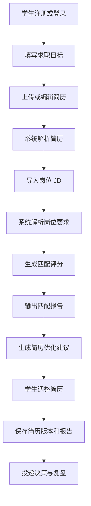
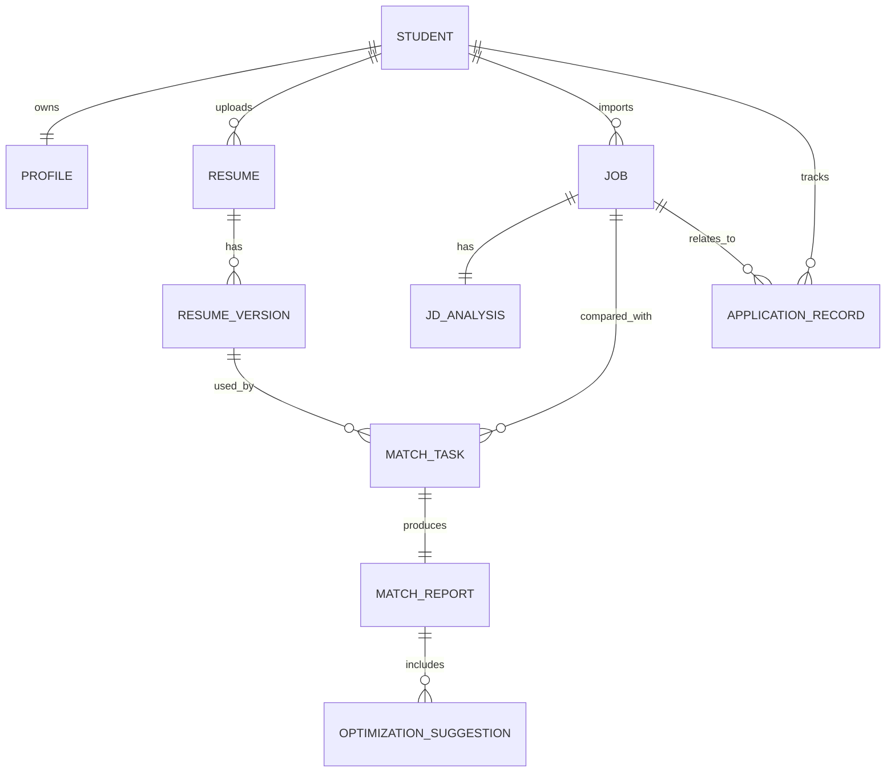

# 「Offer 捕手」需求分析报告

## 1. 文档概述

### 1.1 项目背景

「Offer 捕手」是一款面向学生群体的 AI 求职匹配智能体。学生在校园招聘、实习招聘和初入职场求职过程中，通常会同时面对岗位信息过载、岗位理解成本高、简历与岗位要求不匹配、缺少个性化优化建议等问题。传统招聘平台更偏重岗位发布与搜索，无法充分理解学生的简历、能力结构、职业兴趣和阶段性求职目标，也难以解释“为什么这个岗位适合我”以及“我的简历怎样改更容易通过初筛”。

本产品希望通过简历解析、岗位语义理解、匹配评分、差距诊断和简历优化建议，帮助学生更高效地筛选岗位，并提升目标岗位的简历初筛命中率。

### 1.2 文档目的

本文档用于明确「Offer 捕手」的业务目标、目标用户、核心场景、业务模型、系统概念模型、功能需求、非功能需求和阶段边界，为后续系统概要设计和详细设计提供需求依据。

### 1.3 需求范围

第一阶段聚焦网页端 MVP，实现学生侧核心闭环：

1. 学生维护个人求职画像和简历。
2. 学生导入或粘贴目标岗位 JD。
3. 系统解析简历与岗位要求。
4. 系统生成岗位匹配评分、匹配解释和能力差距分析。
5. 系统给出针对目标岗位的简历优化建议。
6. 学生保存匹配报告和简历优化版本，用于后续投递决策。

微信小程序、手机 App、外部招聘平台 API、公开网页采集、自动投递等能力作为后续阶段扩展。

## 2. 业务分析

### 2.1 业务痛点

| 编号 | 痛点 | 具体表现 | 影响 |
| --- | --- | --- | --- |
| P01 | 岗位信息过载 | 学生需要在多个招聘平台、学校就业网、企业官网之间反复搜索 | 时间成本高，容易错过高匹配岗位 |
| P02 | 岗位要求理解困难 | JD 中存在大量抽象要求，如“具备数据分析能力”“业务敏感度强” | 学生难以判断自身经历是否匹配 |
| P03 | 简历命中率不确定 | 学生不知道简历是否覆盖岗位关键词、能力项和项目证据 | 简历初筛通过率不稳定 |
| P04 | 优化建议缺少针对性 | 通用简历建议无法对应具体岗位要求 | 修改方向模糊，投入产出低 |
| P05 | 求职过程缺少沉淀 | 投递记录、岗位偏好、简历版本分散保存 | 难以复盘和持续优化 |

### 2.2 产品定位

「Offer 捕手」定位为学生求职场景下的 AI 匹配与简历优化助手，不替代招聘平台，而是作为学生在“发现岗位、理解岗位、评估匹配、优化简历、准备投递”过程中的决策支持工具。

产品价值主张：

1. 用 AI 降低岗位筛选成本，让学生从海量岗位中优先关注高匹配机会。
2. 用结构化评分解释简历与岗位之间的匹配关系，让学生知道强项与短板。
3. 用面向具体 JD 的简历优化建议，提高简历初筛命中率。
4. 用历史报告和版本记录沉淀求职过程，帮助学生持续改进。

### 2.3 业务目标

| 目标编号 | 业务目标 | 度量指标 |
| --- | --- | --- |
| G01 | 降低岗位筛选时间 | 学生完成一次岗位初筛的时间减少 50% 以上 |
| G02 | 提高岗位匹配判断质量 | 匹配报告覆盖岗位职责、硬技能、软技能、经历证据、兴趣偏好等维度 |
| G03 | 提升简历优化效率 | 每份目标岗位报告给出不少于 5 条可执行优化建议 |
| G04 | 支撑网页端演示与试用 | 第一阶段可通过浏览器访问核心流程 |
| G05 | 保证隐私与合规 | 简历文件、解析文本、日志均按敏感个人信息处理 |

### 2.4 目标用户

#### 2.4.1 主要用户

| 用户类型 | 用户特征 | 主要需求 |
| --- | --- | --- |
| 应届本科生 | 求职经验较少，岗位认知不足，简历项目有限 | 快速理解岗位要求，找到匹配岗位，获得简历修改方向 |
| 应届研究生 | 有研究或项目经历，但不确定与产业岗位的映射关系 | 将科研、项目、实习经历转换成岗位认可的能力表达 |
| 实习求职学生 | 时间紧、投递频次高，需要快速调整简历 | 快速评估 JD 匹配度，生成目标岗位优化建议 |
| 转专业或跨方向学生 | 背景与目标岗位不完全一致 | 找到可迁移能力，识别能力差距和补齐路径 |

#### 2.4.2 次要用户

| 用户类型 | 用户特征 | 主要需求 |
| --- | --- | --- |
| 高校就业指导老师 | 需要辅助学生做求职指导 | 查看学生常见差距，提供更有针对性的辅导 |
| 项目管理员 | 维护演示岗位库和系统配置 | 管理岗位模板、模型参数、提示词版本和基础数据 |

### 2.5 用户画像

| 画像 | 背景 | 行为特征 | 核心诉求 |
| --- | --- | --- | --- |
| 数据分析求职者 | 统计/经管/计算机相关专业，有课程项目和一段实习 | 在多个平台搜索数据分析、商业分析岗位 | 判断自己的项目经历是否能支撑 JD 要求 |
| 算法实习求职者 | 计算机或人工智能相关专业，有竞赛和论文经历 | 关注算法实习、机器学习工程岗位 | 确认简历是否突出算法能力和工程落地能力 |
| 产品经理求职者 | 专业背景多元，有社团、比赛或实习经历 | JD 描述抽象，难以判断是否匹配 | 把经历转换为产品能力、用户洞察和协作能力表达 |
| 跨专业求职者 | 原专业与目标岗位关联较弱 | 大量投递但反馈少 | 找到可迁移能力和需要补齐的技能项 |

## 3. 业务模型

### 3.1 业务参与者

| 参与者 | 职责 |
| --- | --- |
| 学生用户 | 维护个人画像、上传简历、导入岗位、查看匹配报告、采纳优化建议 |
| 系统智能体 | 解析简历和 JD，进行匹配评分，生成解释和建议 |
| 岗位数据提供方 | 提供岗位描述，可来自学生粘贴、文件导入、后台维护或后续第三方 API |
| 管理员 | 管理岗位库、提示词模板、评分维度、系统配置和异常数据 |
| LLM 服务 | 提供语义抽取、文本分析、建议生成和自然语言解释能力 |

### 3.2 核心业务流程

### 3.3 业务对象模型

| 业务对象 | 说明 | 关键属性 |
| --- | --- | --- |
| 学生 | 使用系统进行求职匹配的主体 | 学校、专业、学历、毕业时间、目标城市、目标行业、目标岗位 |
| 求职画像 | 学生的能力、兴趣和偏好集合 | 技能标签、职业兴趣、求职阶段、期望薪资、可实习时间 |
| 简历 | 学生上传或编辑的简历内容 | 文件、解析文本、教育经历、项目经历、实习经历、技能、获奖证书 |
| 简历版本 | 简历在不同优化阶段的快照 | 版本号、来源报告、变更摘要、创建时间 |
| 岗位 | 用于匹配的招聘岗位 | 岗位名称、公司、城市、职责、要求、薪资、来源 |
| JD 解析结果 | 岗位要求的结构化表达 | 硬技能、软技能、经验要求、学历要求、关键词、加分项 |
| 匹配任务 | 一次简历与岗位的分析任务 | 简历版本、岗位、任务状态、模型版本、创建时间 |
| 匹配报告 | 匹配任务的分析输出 | 总分、维度分、优势、差距、证据、风险、建议 |
| 优化建议 | 针对目标岗位的简历修改建议 | 建议类型、优先级、原始问题、修改方向、示例表达 |
| 投递记录 | 学生对岗位的后续动作 | 状态、投递时间、反馈结果、备注 |

### 3.4 系统概念模型

### 3.5 业务规则

| 编号 | 规则 |
| --- | --- |
| BR01 | 一个学生可以维护多个简历，但同一时间只能设置一个默认简历版本。 |
| BR02 | 一个岗位可以由学生手动创建，也可以来自后台岗位库；MVP 不强依赖外部招聘平台。 |
| BR03 | 匹配报告必须保存生成时使用的简历版本、岗位版本和评分模型版本，保证结果可追溯。 |
| BR04 | 系统不得在未经授权的情况下将简历原文用于公开展示、训练或第三方共享。 |
| BR05 | LLM 生成的建议必须基于简历内容和 JD 内容，不得虚构不存在的经历。 |
| BR06 | 简历优化建议应区分“可直接修改表达”和“需要真实补充经历/技能”的建议。 |
| BR07 | 匹配评分需提供维度解释，不能只输出单一总分。 |

## 4. 功能需求

### 4.1 功能需求列表

| 编号 | 功能模块 | 功能名称 | 优先级 | 说明 |
| --- | --- | --- | --- | --- |
| FR01 | 账号与画像 | 学生注册登录 | P0 | 支持邮箱/手机号或第三方登录，MVP 可先采用邮箱登录或匿名体验模式 |
| FR02 | 账号与画像 | 求职画像维护 | P0 | 学生填写目标岗位、城市、行业、学历、技能、求职阶段等信息 |
| FR03 | 简历管理 | 简历上传 | P0 | 支持 PDF、DOCX、TXT 等格式，文件大小和类型受控 |
| FR04 | 简历管理 | 简历解析 | P0 | 抽取教育经历、项目经历、实习经历、技能、证书、荣誉等结构化信息 |
| FR05 | 简历管理 | 简历版本管理 | P1 | 保存优化前后的版本，支持查看版本摘要 |
| FR06 | 岗位管理 | JD 粘贴导入 | P0 | 学生可粘贴岗位描述并生成岗位记录 |
| FR07 | 岗位管理 | 岗位文件导入 | P1 | 支持从文本或表格导入岗位信息 |
| FR08 | 岗位管理 | 岗位库浏览 | P1 | 管理员可维护演示岗位库，学生可筛选浏览 |
| FR09 | 智能匹配 | 单岗位匹配分析 | P0 | 对指定简历和目标 JD 生成匹配评分与解释 |
| FR10 | 智能匹配 | 多岗位推荐排序 | P1 | 对多个岗位进行匹配评分并按适配度排序 |
| FR11 | 智能匹配 | 差距分析 | P0 | 输出缺失技能、经验不足、表达不足、关键词缺口等问题 |
| FR12 | 简历优化 | 针对 JD 的优化建议 | P0 | 生成可执行的简历修改建议和示例表达 |
| FR13 | 简历优化 | 建议采纳标记 | P1 | 学生可标记建议是否已采纳，用于复盘 |
| FR14 | 报告管理 | 历史匹配报告 | P0 | 保存并查询历史匹配报告 |
| FR15 | 投递跟踪 | 投递记录维护 | P2 | 记录岗位投递、笔试、面试、Offer、拒信等状态 |
| FR16 | 管理后台 | 岗位与配置管理 | P2 | 管理岗位模板、评分规则、提示词版本、系统参数 |

### 4.2 核心用例

#### UC01 上传简历并生成求职画像

| 项目 | 描述 |
| --- | --- |
| 参与者 | 学生用户 |
| 前置条件 | 学生已进入系统，具备待分析简历 |
| 主流程 | 上传简历文件；系统校验文件；解析简历文本；抽取结构化信息；生成技能标签和经历摘要；学生确认或修正画像 |
| 后置条件 | 系统保存简历、简历版本和求职画像 |
| 异常流程 | 文件格式不支持、文件过大、解析失败、文本过短时提示用户重新上传或手动编辑 |

#### UC02 导入目标岗位并分析 JD

| 项目 | 描述 |
| --- | --- |
| 参与者 | 学生用户 |
| 前置条件 | 学生已有目标岗位描述 |
| 主流程 | 粘贴 JD；填写公司、岗位名、城市等基础信息；系统抽取岗位职责、任职要求、关键词和加分项；学生确认保存 |
| 后置条件 | 系统保存岗位记录和 JD 解析结果 |
| 异常流程 | JD 内容过短或缺少有效要求时，系统提示补充信息 |

#### UC03 生成简历与岗位匹配报告

| 项目 | 描述 |
| --- | --- |
| 参与者 | 学生用户、系统智能体、LLM 服务 |
| 前置条件 | 存在可用简历版本和岗位记录 |
| 主流程 | 学生选择简历和岗位；系统创建匹配任务；计算维度评分；调用 LLM 生成解释；生成匹配报告；展示优势、短板、证据和风险 |
| 后置条件 | 系统保存匹配任务和报告 |
| 异常流程 | LLM 调用失败时可返回结构化评分结果，并提示解释内容稍后重试 |

#### UC04 获取简历优化建议

| 项目 | 描述 |
| --- | --- |
| 参与者 | 学生用户、系统智能体 |
| 前置条件 | 匹配报告已生成 |
| 主流程 | 系统基于差距分析生成优化建议；按优先级排序；给出修改方向、建议理由、示例表达和注意事项；学生采纳或忽略建议 |
| 后置条件 | 建议记录与报告关联，学生可据此修改简历 |
| 异常流程 | 如果简历缺少真实经历支撑，系统提示需要补充真实经历或技能，而不是编造内容 |

## 5. 非功能需求

| 编号 | 类别 | 需求 |
| --- | --- | --- |
| NFR01 | 可用性 | 核心流程应在 3 步内完成：上传简历、导入 JD、查看报告。 |
| NFR02 | 性能 | 单岗位匹配报告在常规文件和 JD 长度下应在 30 秒内返回；异步任务需展示进度。 |
| NFR03 | 可扩展性 | LLM Provider、向量数据库、对象存储应可替换，避免绑定单一供应商。 |
| NFR04 | 安全性 | 用户简历、联系方式、求职偏好等数据需加密传输，敏感日志脱敏。 |
| NFR05 | 隐私保护 | 用户可删除简历、岗位、报告和账号数据；默认不将用户数据用于模型训练。 |
| NFR06 | 可解释性 | 匹配分数必须展示维度分、证据引用和原因说明。 |
| NFR07 | 可靠性 | 外部 AI 服务失败时，系统应提供降级结果、重试机制和错误提示。 |
| NFR08 | 兼容性 | 第一阶段支持桌面浏览器和移动浏览器响应式访问。 |
| NFR09 | 可维护性 | 评分规则、提示词模板和模型参数需要版本化管理。 |
| NFR10 | 合规性 | 岗位数据采集、简历处理和第三方模型调用需符合平台协议和个人信息保护要求。 |
| NFR11 | 语言支持 | MVP 默认支持中文简历和中文 JD，并对中英混合技能词、公司名、项目名保持解析容错；完整多语言报告作为后续扩展。 |

## 6. 数据需求

### 6.1 数据分类

| 数据类型 | 示例 | 敏感级别 | 处理要求 |
| --- | --- | --- | --- |
| 账号数据 | 用户 ID、邮箱、手机号 | 中 | 加密传输，限制访问 |
| 简历数据 | 教育经历、联系方式、项目经历 | 高 | 加密存储，日志脱敏，支持删除 |
| 求职偏好 | 目标城市、行业、岗位、薪资 | 中 | 仅用于匹配和推荐 |
| 岗位数据 | 公司、岗位名、JD、薪资范围 | 低到中 | 记录来源，避免违规采集 |
| AI 分析结果 | 标签、评分、建议、报告 | 中 | 与输入版本绑定，支持追溯 |
| 操作日志 | 上传、分析、查看、删除动作 | 中 | 不记录简历原文和敏感字段 |

### 6.2 数据保留规则

1. 简历原文件默认保存，用户可选择删除。
2. 解析文本和结构化结果随简历版本保存，用于报告追溯。
3. 匹配报告保存生成时的模型版本、评分规则版本和提示词版本。
4. 操作日志保存必要审计信息，不保存完整简历原文和完整 JD 原文。
5. 用户注销后，账号、简历、报告和个人画像应进入删除流程。

## 7. 需求优先级与阶段规划

### 7.1 MVP 范围

| 范围 | 功能 |
| --- | --- |
| 学生侧核心流程 | 注册或匿名体验、画像维护、简历上传、JD 粘贴、单岗位匹配、报告展示、优化建议、历史报告 |
| AI 能力 | 简历解析、JD 解析、匹配评分、差距分析、建议生成、报告解释 |
| 基础支撑 | API 服务、数据库、文件存储、任务状态、错误处理、日志脱敏 |
| 部署 | Web 前端静态部署到 GitHub Pages，后端部署到独立云服务或 Serverless 平台 |

### 7.2 后续增强范围

| 阶段 | 能力 |
| --- | --- |
| V1.1 | 多岗位批量匹配、岗位收藏、投递记录、简历版本对比 |
| V1.2 | 管理后台、岗位库维护、学校就业资源导入、评测集建设 |
| V2.0 | 微信小程序、手机 App、第三方招聘 API、消息提醒 |
| V2.1 | 面试准备、笔试复习路径、求职计划管理、就业指导老师协作 |

## 8. 约束与假设

| 编号 | 约束或假设 |
| --- | --- |
| A01 | 第一阶段只要求网页访问，移动端采用响应式网页适配。 |
| A02 | GitHub Pages 仅用于部署静态前端，后端 API 需独立部署。 |
| A03 | MVP 不依赖公开招聘网站爬虫，岗位主要来自用户粘贴、文件导入或后台维护。 |
| A04 | AI 服务可能存在成本、速率和可用性限制，因此需要缓存、异步任务和降级策略。 |
| A05 | 匹配评分是辅助决策结果，不代表招聘方真实筛选结果。 |
| A06 | 系统不得鼓励或生成虚假经历，所有优化建议必须基于真实经历改写。 |
| A07 | 首期以中文求职材料为主要场景，允许中英混合文本输入；英文报告、多语言岗位库和跨地区求职规则后续扩展。 |

## 9. 验收标准

| 编号 | 验收项 | 标准 |
| --- | --- | --- |
| AC01 | 简历上传解析 | 上传一份常规中文简历后，系统能抽取教育、经历、项目、技能等信息。 |
| AC02 | JD 导入解析 | 粘贴一份岗位 JD 后，系统能抽取职责、要求、关键词和加分项。 |
| AC03 | 匹配报告 | 系统能输出总分、维度分、优势、差距、证据引用和风险提示。 |
| AC04 | 优化建议 | 系统能生成面向目标 JD 的建议，包含优先级、理由、修改方向和示例表达。 |
| AC05 | 历史记录 | 学生能查看历史岗位、历史报告和对应简历版本。 |
| AC06 | 隐私删除 | 学生能删除简历和报告，删除后普通查询不可再访问。 |
| AC07 | 部署访问 | 前端可通过浏览器访问，并能调用后端 API 完成核心流程。 |

## 10. 需求追踪矩阵

| 原始目标 | 需求覆盖 | 后续设计映射 |
| --- | --- | --- |
| 帮助学生有效匹配合适岗位 | FR02、FR04、FR06、FR09、FR10、FR11 | 匹配评分服务、岗位解析服务、推荐排序流程 |
| 提升心仪岗位初筛命中率 | FR04、FR09、FR11、FR12、FR13 | 简历优化服务、报告解释服务、提示词模板 |
| 前后端分离系统 | NFR03、NFR08、A02 | React 前端、FastAPI 后端、REST API |
| 第一阶段网页访问和 GitHub Pages 部署 | A01、A02、AC07 | 静态前端部署、独立后端 API、CORS 配置 |
