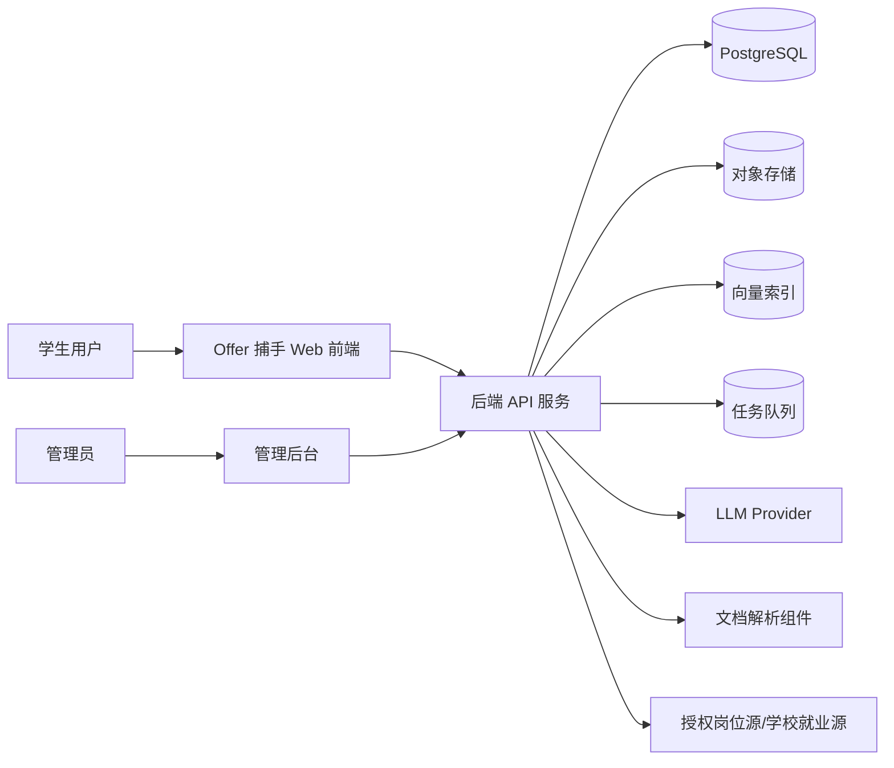
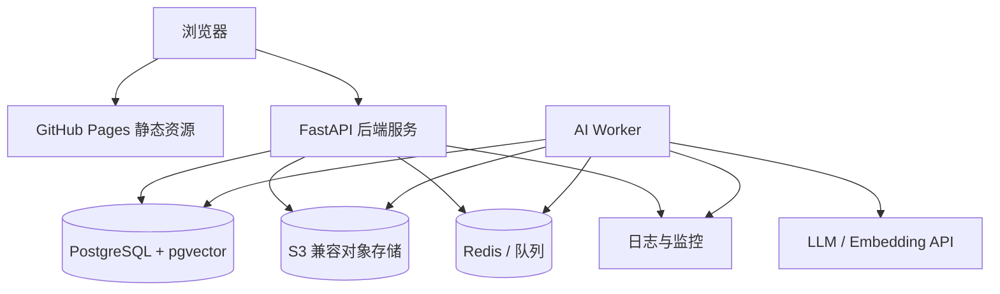
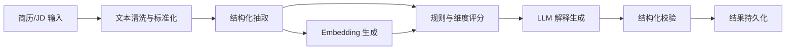
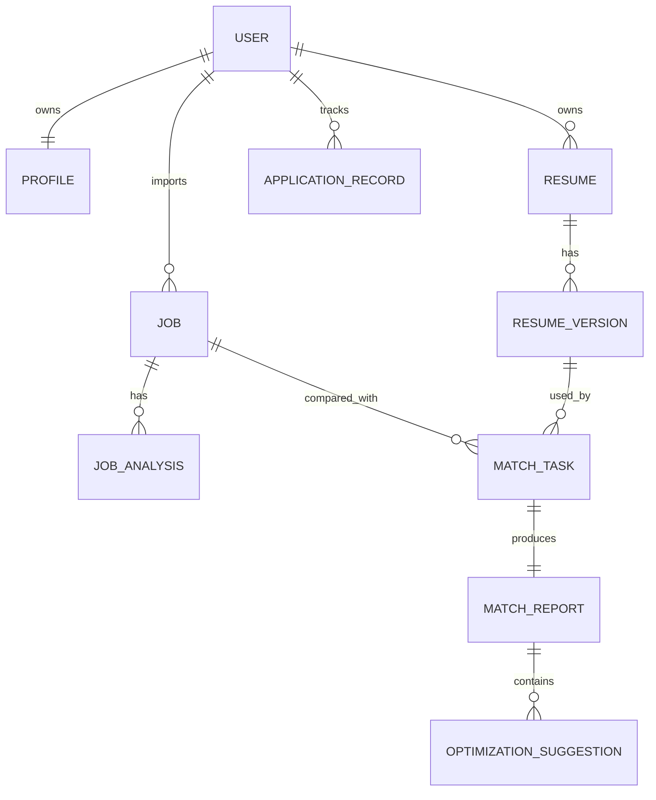
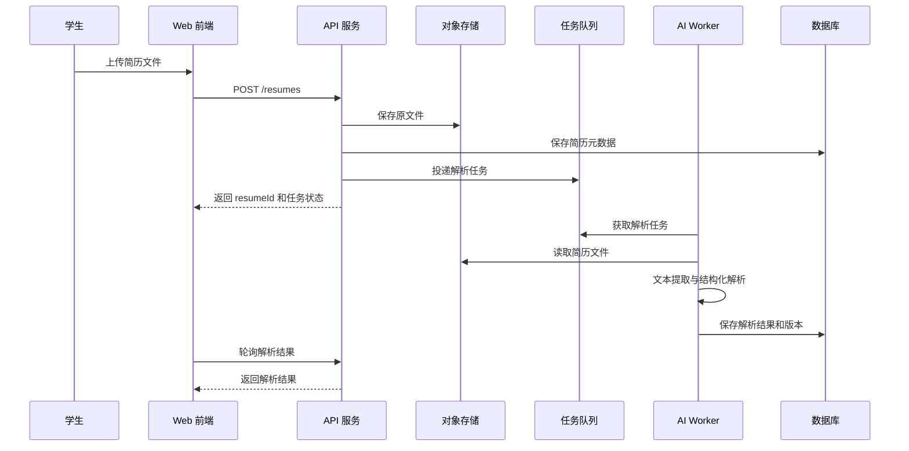
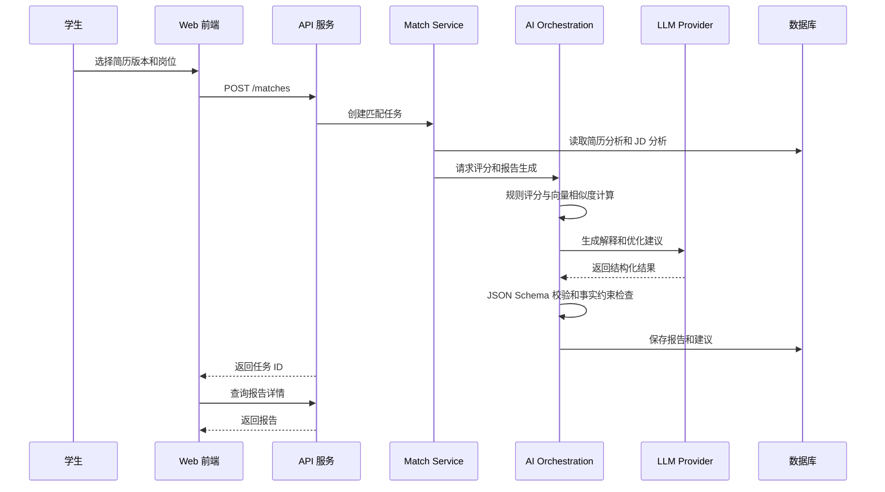

# 「Offer 捕手」系统概要设计说明书

## 1. 文档概述

### 1.1 设计目标

本文档在需求分析基础上，定义「Offer 捕手」第一阶段网页端 MVP 的系统架构、技术方案、模块划分、部署方案、数据流、外部接口和关键设计约束，为详细设计和后续实现提供总体蓝图。

### 1.2 设计原则

1. 前后端分离：前端负责交互体验和状态展示，后端负责业务逻辑、数据持久化和 AI 编排。
2. MVP 优先：优先完成简历上传、JD 导入、匹配报告、优化建议和历史记录闭环。
3. AI 可替换：LLM Provider、Embedding 模型和向量检索组件通过适配层接入，降低供应商绑定风险。
4. 可解释评分：匹配结果必须包含维度分、证据、原因和建议，不输出黑盒分数。
5. 隐私保护：简历数据作为敏感个人信息处理，设计中默认采用最小化存储、访问控制和脱敏日志。
6. 可演进部署：第一阶段支持 GitHub Pages 静态前端和独立后端 API，后续可扩展到小程序、App 和更多云部署形态。

## 2. 总体架构

### 2.1 架构风格

系统采用前后端分离的分层架构：

| 层级 | 职责 |
| --- | --- |
| 表现层 | Web 前端页面、移动端响应式适配、用户交互、报告可视化 |
| 接入层 | API 网关或 FastAPI 路由、认证鉴权、CORS、限流、请求校验 |
| 业务层 | 用户画像、简历管理、岗位管理、匹配任务、报告管理、投递记录 |
| AI 编排层 | 简历解析、JD 解析、岗位发现、Embedding、匹配评分、机会梯度分层、LLM 解释、优化建议生成、简历改写 |
| 数据层 | PostgreSQL、对象存储、向量索引、缓存、任务队列 |
| 运维层 | 日志、监控、告警、配置管理、模型与提示词版本管理 |

### 2.2 系统上下文



### 2.3 部署拓扑



第一阶段建议部署方式：

| 组件 | 推荐方案 | 说明 |
| --- | --- | --- |
| Web 前端 | React + Vite，部署到 GitHub Pages | 满足网页访问和静态部署要求 |
| API 服务 | Python + FastAPI | 适合 AI 编排、文档解析和异步任务 |
| 数据库 | PostgreSQL | 存储用户、简历元数据、岗位、报告和配置 |
| 向量检索 | pgvector 或独立向量数据库 | MVP 可优先使用 pgvector 降低复杂度 |
| 文件存储 | S3 兼容对象存储或云厂商对象存储 | 保存简历原文件和导入文件 |
| 任务队列 | Redis + RQ/Celery/Arq | 处理耗时解析和 LLM 调用任务 |
| LLM 服务 | OpenAI 兼容 API、DeepSeek、通义、智谱等可替换 | 通过 Provider Adapter 接入 |

## 3. 技术方案

### 3.1 前端技术方案

| 技术 | 用途 | 选择理由 |
| --- | --- | --- |
| React | 页面与组件开发 | 生态成熟，适合交互式报告和状态管理 |
| Vite | 构建工具 | 构建快，适合 GitHub Pages 静态部署 |
| TypeScript | 类型约束 | 降低接口字段和复杂状态错误 |
| React Router | 页面路由 | 支持报告详情、岗位详情、简历详情等页面 |
| TanStack Query | 服务端状态管理 | 处理 API 请求、缓存、重试和加载状态 |
| Tailwind CSS 或 CSS Modules | 样式 | 快速实现响应式、可维护的 UI |

### 3.2 后端技术方案

| 技术 | 用途 | 选择理由 |
| --- | --- | --- |
| FastAPI | REST API 服务 | 类型友好、性能较好、适合 Python AI 生态 |
| Pydantic | 请求响应模型 | 保证接口字段校验和文档生成 |
| SQLAlchemy | 数据访问 | 支持复杂关系模型和数据库迁移 |
| Alembic | 数据库迁移 | 管理表结构版本 |
| PostgreSQL | 主数据库 | 适合结构化业务数据和事务一致性 |
| pgvector | 向量检索 | MVP 可减少独立向量库运维成本 |
| Redis | 缓存和任务队列 | 支撑异步任务、限流和任务状态 |
| Celery/RQ/Arq | 后台任务 | 处理解析、Embedding、LLM 调用等耗时任务 |

### 3.3 AI 技术方案

| 能力 | 方案 |
| --- | --- |
| 简历解析 | 文件解析器提取文本，规则抽取基础字段，LLM 补充结构化信息 |
| JD 解析 | LLM 将 JD 转换为职责、要求、技能、关键词、加分项等结构化结果 |
| 语义匹配 | 结合规则评分、关键词覆盖、Embedding 相似度和 LLM 评估 |
| 岗位发现 | 通过后台岗位库、学校就业源、第三方授权 API 获取候选岗位，并用画像和简历标签做初筛 |
| 分层岗位推荐 | 结合岗位匹配度、申请成功率预测、硬性门槛、机会价值、竞争风险和用户偏好，生成拓展机会、重点匹配、基础保障等机会梯度 |
| 报告解释 | LLM 基于结构化评分和证据生成自然语言解释 |
| 简历优化 | LLM 按建议模板生成可执行修改建议，禁止虚构经历 |
| 简历改写 | 用户确认采纳建议后，LLM 在限定片段内生成改写草稿，并输出差异说明 |
| 质量控制 | JSON Schema 校验、事实约束、敏感信息过滤、提示词版本管理 |

## 4. 模块划分

### 4.1 前端模块

| 模块 | 职责 | 对外接口 |
| --- | --- | --- |
| 认证与会话模块 | 登录、注册、Token 管理、用户状态 | 调用 Auth API，提供用户上下文 |
| 首页/工作台模块 | 展示核心入口、最近报告、待处理任务 | 调用 Dashboard API |
| 求职画像模块 | 维护目标岗位、城市、行业、技能标签 | 调用 Profile API |
| 简历管理模块 | 上传简历、查看解析结果、管理版本 | 调用 Resume API |
| 岗位管理模块 | 粘贴 JD、查看岗位库、编辑岗位信息 | 调用 Job API |
| AI 岗位发现模块 | 选择岗位源、配置检索条件、查看候选岗位 | 调用 Job Discovery API |
| 匹配分析模块 | 创建匹配任务、轮询进度、展示报告 | 调用 Match API 与 Report API |
| 分层推荐模块 | 按机会梯度展示岗位推荐组合，包含匹配度、申请成功率预测和风险等级 | 调用 Recommendation API |
| 优化建议模块 | 展示建议、标记采纳、生成简历修改清单 | 调用 Suggestion API |
| AI 简历改写模块 | 展示改写前后差异，允许用户确认、微调或放弃 | 调用 Resume Rewrite API |
| 历史记录模块 | 查询历史报告和岗位记录 | 调用 Report API、Application API |
| 管理后台模块 | 管理岗位、提示词、评分规则 | 调用 Admin API |

### 4.2 后端业务模块

| 模块 | 职责 | 主要数据 |
| --- | --- | --- |
| Auth Service | 用户注册、登录、Token 校验、权限控制 | User、Session |
| Profile Service | 求职画像维护和技能标签管理 | Profile、SkillTag |
| Resume Service | 简历上传、文件管理、解析结果保存、版本管理 | Resume、ResumeVersion、ResumeAnalysis |
| Job Service | JD 导入、岗位信息维护、岗位解析 | Job、JobAnalysis |
| Job Discovery Service | 岗位源接入、候选岗位检索、授权状态校验、过期岗位过滤 | JobDiscoveryTask、JobSourceConfig |
| Match Service | 匹配任务创建、评分计算、任务状态管理 | MatchTask、MatchScore |
| Recommendation Service | 根据岗位匹配度、申请成功率预测、机会价值和风险等级生成分层推荐组合 | RecommendationTier、RecommendationList |
| Report Service | 匹配报告生成、查询、导出 | MatchReport、Suggestion |
| Resume Rewrite Service | 根据用户采纳建议生成改写草稿、差异和新简历版本 | ResumeRewriteTask、ResumeVersion |
| AI Orchestration Service | LLM 调用、Embedding、Prompt 管理、结果校验 | PromptTemplate、ModelCallLog |
| Application Service | 投递记录、状态流转、复盘备注 | ApplicationRecord |
| Admin Service | 岗位库、评分规则、提示词版本管理 | AdminConfig、ScoringRule |
| Audit Service | 审计日志、脱敏日志、安全事件 | AuditLog |

### 4.3 AI 编排模块



AI 编排模块对外提供以下内部服务接口：

| 接口 | 输入 | 输出 |
| --- | --- | --- |
| parse_resume | 简历文本、文件元数据 | 简历结构化结果、技能标签、经历摘要 |
| parse_job | JD 文本、岗位元数据 | 岗位职责、要求、关键词、加分项 |
| discover_jobs | 求职画像、简历标签、岗位源配置 | 候选岗位列表、来源、初筛理由 |
| score_match | 简历分析结果、岗位分析结果、画像 | 总分、维度分、证据、风险 |
| classify_job_tiers | 候选岗位、岗位匹配度、申请成功率预测、机会价值、风险等级、用户偏好 | 机会梯度分层结果 |
| generate_report | 评分结果、简历证据、岗位要求 | 匹配报告正文 |
| generate_suggestions | 匹配差距、JD 要求、简历内容 | 优化建议列表 |
| rewrite_resume | 原简历片段、用户采纳建议、JD 要求 | 改写草稿、差异摘要、新版本建议 |

## 5. 数据架构

### 5.1 逻辑数据分区

| 数据区 | 数据内容 | 存储介质 |
| --- | --- | --- |
| 用户与权限数据 | 用户、会话、角色、权限 | PostgreSQL |
| 求职业务数据 | 画像、简历元数据、岗位、报告、建议、投递记录 | PostgreSQL |
| 文件数据 | 简历原文件、导入文件、导出报告 | 对象存储 |
| 向量数据 | 简历片段、岗位要求、技能标签 Embedding | pgvector/向量数据库 |
| 缓存与任务数据 | 任务状态、限流计数、短期缓存 | Redis |
| 运维数据 | 审计日志、模型调用日志、错误日志 | PostgreSQL/日志平台 |

### 5.2 核心实体关系



## 6. 外部接口设计

### 6.1 接口规范

| 项目 | 规范 |
| --- | --- |
| 协议 | HTTPS |
| 风格 | RESTful JSON API |
| 鉴权 | Bearer Token，MVP 可支持匿名试用 Token |
| 编码 | UTF-8 |
| 时间格式 | ISO 8601 |
| 文件上传 | multipart/form-data |
| 错误格式 | 统一 error 对象，包含 code、message、requestId、details |
| 版本路径 | /api/v1 |

统一响应结构：

```json
{
  "data": {},
  "requestId": "req_20260613_001",
  "timestamp": "2026-06-13T10:00:00Z"
}
```

统一错误结构：

```json
{
  "error": {
    "code": "RESUME_PARSE_FAILED",
    "message": "简历解析失败，请重新上传或手动编辑文本。",
    "requestId": "req_20260613_002",
    "details": {}
  }
}
```

### 6.2 用户与认证接口

| 方法 | 路径 | 说明 | 输入 | 输出 |
| --- | --- | --- | --- | --- |
| POST | /api/v1/auth/register | 注册用户 | email、password、nickname | user、accessToken |
| POST | /api/v1/auth/login | 用户登录 | email、password | user、accessToken |
| POST | /api/v1/auth/guest | 创建匿名试用会话 | deviceId | guestUser、accessToken |
| GET | /api/v1/users/me | 获取当前用户 | Token | user |
| DELETE | /api/v1/users/me | 注销当前用户 | Token、confirm | deletionTaskId |

### 6.3 求职画像接口

| 方法 | 路径 | 说明 |
| --- | --- | --- |
| GET | /api/v1/profile | 查询求职画像 |
| PUT | /api/v1/profile | 更新求职画像 |
| GET | /api/v1/profile/skills | 查询技能标签建议 |

画像请求示例：

```json
{
  "targetRoles": ["数据分析师", "商业分析实习生"],
  "targetCities": ["上海", "杭州"],
  "industries": ["互联网", "消费品"],
  "educationLevel": "本科",
  "graduationYear": 2026,
  "skills": ["SQL", "Python", "Excel", "Tableau"],
  "careerInterests": ["数据驱动决策", "用户增长"]
}
```

### 6.4 简历接口

| 方法 | 路径 | 说明 | 关键字段 |
| --- | --- | --- | --- |
| POST | /api/v1/resumes | 上传简历 | file、title、isDefault |
| GET | /api/v1/resumes | 查询简历列表 | page、pageSize |
| GET | /api/v1/resumes/{resumeId} | 查询简历详情 | resumeId |
| DELETE | /api/v1/resumes/{resumeId} | 删除简历 | resumeId |
| POST | /api/v1/resumes/{resumeId}/parse | 创建解析任务 | resumeId |
| GET | /api/v1/resumes/{resumeId}/analysis | 查询解析结果 | resumeId |
| POST | /api/v1/resumes/{resumeId}/versions | 创建简历版本 | sourceReportId、content |

### 6.5 岗位接口

| 方法 | 路径 | 说明 | 关键字段 |
| --- | --- | --- | --- |
| POST | /api/v1/jobs | 创建岗位/JD | title、company、city、jdText、sourceType |
| GET | /api/v1/jobs | 查询岗位列表 | keyword、city、status、page |
| GET | /api/v1/jobs/{jobId} | 查询岗位详情 | jobId |
| PUT | /api/v1/jobs/{jobId} | 更新岗位 | title、company、jdText |
| DELETE | /api/v1/jobs/{jobId} | 删除岗位 | jobId |
| POST | /api/v1/jobs/{jobId}/parse | 创建 JD 解析任务 | jobId |
| GET | /api/v1/jobs/{jobId}/analysis | 查询 JD 解析结果 | jobId |

### 6.5.1 岗位发现与分层推荐接口

| 方法 | 路径 | 说明 | 关键字段 |
| --- | --- | --- | --- |
| POST | /api/v1/job-discovery/tasks | 创建 AI 岗位发现任务 | profileId、resumeVersionId、sourceIds、filters |
| GET | /api/v1/job-discovery/tasks/{taskId} | 查询岗位发现任务状态 | taskId |
| GET | /api/v1/job-discovery/tasks/{taskId}/candidates | 查询候选岗位列表 | taskId、tier、page |
| POST | /api/v1/recommendations/tiered | 基于候选岗位生成分层岗位推荐组合 | discoveryTaskId、resumeVersionId、strategy |
| GET | /api/v1/recommendations/{recommendationId} | 查询分层岗位推荐结果 | recommendationId |
| POST | /api/v1/job-sources/authorize | 授权岗位数据源 | sourceType、authCode、scope |

### 6.6 匹配与报告接口

| 方法 | 路径 | 说明 | 关键字段 |
| --- | --- | --- | --- |
| POST | /api/v1/matches | 创建匹配任务 | resumeVersionId、jobId、profileId |
| GET | /api/v1/matches/{matchTaskId} | 查询任务状态 | matchTaskId |
| GET | /api/v1/reports | 查询报告列表 | page、jobId、resumeId |
| GET | /api/v1/reports/{reportId} | 查询报告详情 | reportId |
| POST | /api/v1/reports/{reportId}/suggestions/regenerate | 重新生成建议 | reportId、focusArea |
| PATCH | /api/v1/suggestions/{suggestionId} | 更新建议状态 | status、note |
| POST | /api/v1/resume-rewrites | 基于已采纳建议生成简历改写草稿 | resumeVersionId、reportId、suggestionIds |
| GET | /api/v1/resume-rewrites/{rewriteTaskId} | 查询改写任务和差异结果 | rewriteTaskId |
| POST | /api/v1/resume-rewrites/{rewriteTaskId}/confirm | 确认改写并生成新简历版本 | rewriteTaskId、editedContent |

匹配任务响应示例：

```json
{
  "data": {
    "matchTaskId": "mt_001",
    "status": "queued",
    "estimatedSeconds": 20
  }
}
```

报告摘要响应示例：

```json
{
  "data": {
    "reportId": "rpt_001",
    "overallScore": 82,
    "level": "high",
    "dimensionScores": [
      { "code": "hard_skills", "name": "硬技能", "score": 86 },
      { "code": "experience", "name": "经历相关度", "score": 78 },
      { "code": "keywords", "name": "关键词覆盖", "score": 84 }
    ],
    "strengths": ["SQL 与数据分析项目经历匹配岗位核心要求"],
    "gaps": ["缺少 A/B 实验相关明确表达"],
    "suggestionCount": 7
  }
}
```

### 6.7 投递记录接口

| 方法 | 路径 | 说明 |
| --- | --- | --- |
| POST | /api/v1/applications | 创建投递记录 |
| GET | /api/v1/applications | 查询投递记录 |
| PATCH | /api/v1/applications/{applicationId} | 更新投递状态 |
| DELETE | /api/v1/applications/{applicationId} | 删除投递记录 |

### 6.8 管理后台接口

| 方法 | 路径 | 说明 |
| --- | --- | --- |
| GET | /api/v1/admin/jobs | 查询全局岗位库 |
| POST | /api/v1/admin/jobs | 创建后台岗位 |
| PUT | /api/v1/admin/jobs/{jobId} | 更新后台岗位 |
| GET | /api/v1/admin/prompts | 查询提示词模板 |
| POST | /api/v1/admin/prompts | 新增提示词版本 |
| GET | /api/v1/admin/scoring-rules | 查询评分规则 |
| PUT | /api/v1/admin/scoring-rules/{ruleId} | 更新评分规则 |

## 7. 关键业务流程设计

### 7.1 简历解析流程



### 7.2 匹配报告生成流程



## 8. 安全与隐私设计

| 领域 | 设计 |
| --- | --- |
| 传输安全 | 全站 HTTPS，跨域请求限制在已配置前端域名 |
| 鉴权 | Bearer Token，管理后台接口需要管理员角色 |
| 文件安全 | 限制文件类型和大小，文件名重命名，隔离对象存储路径 |
| 数据权限 | 用户只能访问自己的简历、岗位、报告和投递记录 |
| 日志脱敏 | 不记录完整简历原文、手机号、邮箱、身份证号等敏感信息 |
| LLM 调用 | 发送给第三方模型前进行最小化字段裁剪，记录模型调用版本和用途 |
| 删除机制 | 删除简历时同步删除文件、解析文本、向量索引和相关报告访问入口 |
| 防滥用 | 限流、文件上传频控、模型调用配额、异常任务熔断 |

## 9. 可观测性与运维设计

| 能力 | 设计 |
| --- | --- |
| 请求追踪 | 每个 API 请求生成 requestId，贯穿日志和错误响应 |
| 任务追踪 | 匹配任务、解析任务记录状态、耗时、失败原因和重试次数 |
| 模型调用日志 | 记录 Provider、模型名、输入输出 token 数、耗时、错误码，不记录完整敏感内容 |
| 指标监控 | API QPS、错误率、平均响应时间、任务成功率、LLM 成本、队列积压 |
| 告警 | LLM 调用失败率过高、解析任务失败率过高、队列积压、存储异常 |
| 配置管理 | 模型参数、评分权重、提示词模板版本化，支持灰度切换 |

## 10. 风险与应对

| 风险 | 影响 | 应对方案 |
| --- | --- | --- |
| LLM 幻觉 | 生成不真实建议或误导学生 | 结构化输入、事实约束、禁止编造经历、结果校验 |
| 第三方模型不可用 | 报告生成失败或延迟 | 队列重试、Provider Adapter、降级评分结果 |
| 简历隐私泄露 | 高合规风险 | 加密传输、权限隔离、脱敏日志、删除机制 |
| 岗位数据合规问题 | 可能违反招聘平台协议 | MVP 以用户导入和后台维护为主，后续 API 需授权 |
| 评分不可解释 | 用户不信任结果 | 输出维度分、证据引用和建议理由 |
| GitHub Pages 动态能力不足 | 无法直接承载后端逻辑 | 静态前端与独立 API 分离部署 |

## 11. 概要设计验收点

1. 系统架构覆盖前端、后端、AI、数据、部署、运维和安全模块。
2. 每个核心模块职责清晰，并有明确的对外接口或内部服务接口。
3. GitHub Pages 部署约束被正确处理，后端能力独立部署。
4. 匹配报告生成流程具备可解释性、可追溯性和隐私保护能力。
5. 外部 API 能支撑 MVP 的简历上传、JD 导入、匹配分析、报告展示和建议采纳闭环。
