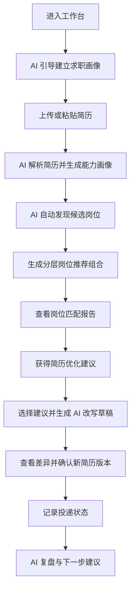
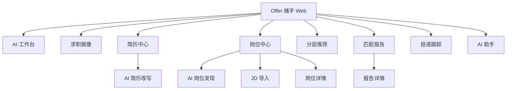

# 「Offer 捕手」AI 原生用户交互与界面设计方案

## 1. 文档概述

### 1.1 文档目的

本文档在需求分析、系统概要设计和系统详细设计基础上，进一步细化「Offer 捕手」的用户交互逻辑、界面信息架构、核心页面设计、AI 交互组件、视觉风格和体验验收标准。本文重点回答：如何让产品区别于传统招聘平台，成为一款以 AI 能力为核心卖点的学生求职平台。

### 1.2 设计范围

本文覆盖网页端 MVP 与 增强能力的交互方案：

1. 学生首次进入系统后的 AI 引导建档流程。
2. 求职画像、简历解析、岗位发现、分层岗位推荐、岗位诊断、简历优化、AI 简历改写、投递跟踪等核心流程。
3. AI 助手、任务进度、证据引用、申请成功率预测、风险提示、差异预览等 AI 原生组件。
4. 页面布局、导航结构、响应式设计、视觉风格、配色和交互状态。

### 1.3 体验设计目标

| 目标编号 | 目标 | 说明 |
| --- | --- | --- |
| UX01 | 降低学生求职决策成本 | 将“搜索、阅读、判断、修改”的分散动作收敛为 AI 引导的连续流程 |
| UX02 | 强化 AI 原生差异 | 让 AI 不只是聊天入口，而是贯穿岗位发现、匹配解释、简历改写和投递复盘的操作系统 |
| UX03 | 增强可解释与可信度 | 所有 AI 结论展示证据、来源、置信度、不确定性和用户可控操作 |
| UX04 | 缩短从建议到行动的路径 | 用户采纳建议后可直接进入 AI 改写、差异确认和新版本保存 |
| UX05 | 保持专业、清晰、克制 | 界面面向求职决策场景，采用工作台式信息组织，避免营销型页面表达 |

## 2. AI 原生体验定位

### 2.1 与传统求职平台的差异

| 维度 | 传统求职平台 | Offer 捕手 AI 原生体验 |
| --- | --- | --- |
| 岗位获取 | 用户输入关键词后自行筛选 | AI 基于求职画像、简历能力和授权岗位源主动发现候选岗位 |
| 岗位判断 | 用户阅读 JD 后主观判断 | 系统输出岗位匹配度、申请成功率预测、机会价值、风险等级和证据 |
| 推荐方式 | 按关键词、热度、发布时间排序 | 按机会梯度生成分层岗位推荐组合，帮助用户形成投递组合策略 |
| 简历优化 | 提供通用文章或模板 | 面向具体 JD 生成建议，并支持用户确认后的 AI 改写草稿 |
| 求职过程 | 岗位、简历、投递反馈分散 | 围绕学生求职目标建立连续任务流和历史复盘 |
| AI 角色 | 辅助聊天或问答 | 作为主动型求职智能体，持续提出下一步行动建议 |

### 2.2 AI 原生设计原则

| 原则 | 交互含义 |
| --- | --- |
| AI 主动但不越权 | AI 可以建议下一步、自动生成草稿、整理候选岗位，但关键动作必须由用户确认 |
| 结论必须可解释 | 匹配度、申请成功率预测、风险等级和改写建议都要展示依据 |
| 过程必须可回退 | 简历改写、岗位收藏、推荐筛选、报告生成都保留版本和撤销入口 |
| AI 输出结构化 | 聊天只是入口，最终产物应落到岗位卡片、报告、建议清单、差异视图和任务列表 |
| 不承诺结果 | 申请成功率预测只作为参考，不表达录用或初筛通过承诺 |
| 保护学生真实性 | 简历改写只优化表达，不虚构经历、技能、证书、学校、公司和数据指标 |

### 2.3 AI 助手角色设定

系统内 AI 助手不应只是通用问答机器人，而应根据任务上下文切换角色。

| 角色 | 出现场景 | 主要动作 |
| --- | --- | --- |
| 求职引导员 | 首次进入、画像缺失、流程中断 | 提问、补全信息、建议下一步 |
| 岗位分析师 | 岗位发现、分层推荐、岗位详情 | 解析 JD、解释匹配、指出风险 |
| 简历编辑顾问 | 简历诊断、建议采纳、AI 改写 | 定位问题、生成草稿、解释改写差异 |
| 投递策略顾问 | 推荐组合、投递记录、复盘 | 建议投递优先级、追踪状态、生成复盘结论 |
| 面试准备助手 | 投递后、面试前 | 根据 JD 和简历生成面试问题、准备清单和回答框架 |

## 3. 用户旅程设计

### 3.1 核心用户旅程



### 3.2 AI 触点矩阵

| 求职阶段 | 用户目标 | AI 触点 | 主要输出 |
| --- | --- | --- | --- |
| 建立画像 | 快速告诉系统自己的背景和目标 | AI 访谈、简历解析、技能标签建议 | 求职画像、能力标签、偏好缺口 |
| 发现岗位 | 不想手动逐个平台找岗位 | AI 岗位发现、岗位源授权、候选岗位过滤 | 候选岗位列表、岗位来源、初筛理由 |
| 制定策略 | 不知道先投哪些岗位 | 分层岗位推荐组合、申请成功率预测 | 机会梯度、投递优先级、风险等级 |
| 判断岗位 | 看懂某个岗位是否适合自己 | 单岗位诊断、证据引用、缺口分析 | 匹配报告、优势、差距、行动建议 |
| 优化简历 | 想提升目标岗位初筛命中率 | 建议清单、AI 改写、差异预览 | 改写草稿、新简历版本、变更说明 |
| 投递跟踪 | 记录进展并复盘 | 投递看板、AI 下一步提醒 | 状态建议、准备清单、复盘报告 |

### 3.3 关键体验闭环

| 闭环 | 起点 | AI 动作 | 用户确认 | 产物 |
| --- | --- | --- | --- | --- |
| 画像闭环 | 简历或问答 | 抽取能力和偏好 | 用户修正字段 | 求职画像 |
| 岗位闭环 | 授权岗位源或 JD | 发现、解析、过滤岗位 | 用户收藏或忽略 | 候选岗位池 |
| 推荐闭环 | 候选岗位池 | 分层推荐和预测 | 用户选择投递组合 | 分层岗位推荐组合 |
| 诊断闭环 | 单个岗位 | 生成匹配报告 | 用户查看证据和风险 | 岗位匹配报告 |
| 改写闭环 | 已采纳建议 | 生成改写草稿 | 用户确认或编辑 | 新简历版本 |
| 复盘闭环 | 投递反馈 | 总结有效策略 | 用户更新状态 | 下一轮推荐参数 |

## 4. 信息架构与导航

### 4.1 总体信息架构



### 4.2 主导航设计

桌面端采用左侧导航 + 顶部上下文栏 + 右侧 AI 助手面板的工作台结构。

| 导航项 | 功能定位 | 一级入口是否展示 |
| --- | --- | --- |
| AI 工作台 | 聚合任务、下一步建议、最近报告 | 是 |
| 求职画像 | 背景、目标、偏好、能力标签 | 是 |
| 简历中心 | 简历上传、解析、版本、AI 改写 | 是 |
| 岗位中心 | JD 导入、岗位发现、岗位库 | 是 |
| 分层推荐 | 机会梯度、推荐组合、投递优先级 | 是 |
| 匹配报告 | 单岗位诊断和历史报告 | 是 |
| 投递跟踪 | 收藏、投递、面试、Offer 状态 | 是 |
| 系统设置 | 账号、隐私、数据源授权 | 次级入口 |

### 4.3 页面布局模型

```text
┌──────────────────────────────────────────────────────────────┐
│ 顶部上下文栏：当前目标岗位方向 / 默认简历版本 / 数据源状态       │
├──────────────┬───────────────────────────────┬───────────────┤
│ 左侧导航      │ 主工作区                        │ AI 助手面板    │
│              │ 报告、推荐、简历、任务内容        │ 问答、建议、操作 │
└──────────────┴───────────────────────────────┴───────────────┘
```

设计要点：

1. 主工作区承载结构化结果，AI 助手面板承载解释、追问和下一步动作。
2. AI 输出不能只停留在对话流，必须能转化为页面内的卡片、清单、报告或草稿。
3. 顶部上下文栏始终展示当前默认简历版本、目标方向和岗位数据源状态，减少用户迷路。
4. 移动端收起左侧导航，AI 助手面板改为底部抽屉或页面内按钮。

## 5. 核心页面设计

### 5.1 AI 工作台

AI 工作台是产品首页，不做营销落地页。用户进入后直接看到求职任务状态和 AI 下一步建议。

| 区域 | 内容 | AI 特色 |
| --- | --- | --- |
| 求职进度摘要 | 画像完整度、默认简历、候选岗位数、待处理建议数 | AI 判断当前最影响求职效率的缺口 |
| 下一步行动 | 继续完善画像、生成推荐组合、改写简历、准备面试 | AI 根据上下文排序行动项 |
| 推荐组合概览 | 各机会梯度岗位数量、平均匹配度、主要风险 | AI 汇总当前投递组合健康度 |
| 最近报告 | 最近生成的岗位匹配报告 | AI 标记高价值报告和待优化岗位 |
| AI 助手面板 | 可问“我今天该先做什么”一类问题 | 输出可执行动作，而不是长文本回答 |

### 5.2 首次使用与求职画像页面

首次使用采用“AI 访谈 + 结构化表单”的混合方式。AI 负责降低输入成本，表单负责保证字段清晰可编辑。

| 步骤 | 用户动作 | AI 动作 | 页面反馈 |
| --- | --- | --- | --- |
| 选择目标 | 输入目标岗位、城市、行业 | 给出岗位方向补全和同义词建议 | 目标标签可编辑 |
| 上传简历 | 上传或粘贴简历 | 解析教育、技能、项目、实习 | 展示字段置信度 |
| 补充偏好 | 填写岗位类型、期望地点、时间约束 | 识别缺失偏好并追问 | 缺失项高亮 |
| 确认画像 | 检查系统生成的求职画像 | 总结优势和不确定字段 | 用户确认后进入工作台 |

画像页面必须允许用户手动覆盖 AI 结果，AI 只能作为建议来源。

### 5.3 简历中心

简历中心是 AI 能力的基础入口，应突出“解析、版本、目标岗位适配”三件事。

| 模块 | 展示内容 | 交互说明 |
| --- | --- | --- |
| 默认简历卡片 | 当前版本、解析状态、最近匹配报告 | 支持设为默认、重新解析、删除 |
| 能力画像 | 技能、项目、实习、证书、优势标签 | 标签展示证据来源和置信度 |
| 版本列表 | 原始版本、AI 改写版本、手动修改版本 | 支持对比和恢复 |
| 待处理建议 | 来自不同报告的未采纳建议 | 可批量选择进入 AI 改写 |

### 5.4 AI 岗位发现页面

岗位发现页面体现产品与传统搜索列表的差异：用户不从关键词搜索开始，而从目标和授权数据源开始。

| 区域 | 内容 | 设计说明 |
| --- | --- | --- |
| 岗位源选择 | 后台岗位库、学校就业源、第三方授权 API、用户导入列表 | 展示授权状态和最近同步时间 |
| 检索条件 | 目标岗位、城市、行业、岗位类型、可实习时间 | 默认来自求职画像，可手动调整 |
| AI 检索任务 | 进度、已发现数量、过滤数量、失败原因 | 长任务需要可离开、可回到工作台继续查看 |
| 候选岗位列表 | 岗位名称、公司、来源、有效期、初筛理由 | 支持加入推荐分析或忽略 |

候选岗位卡片不应只展示岗位名称。至少展示岗位来源、更新时间、关键要求、与用户画像的初筛命中点。

### 5.5 分层岗位推荐页面

分层岗位推荐页面是 AI 原生差异的核心界面。它不是简单排行榜，而是帮助学生形成结构化投递组合。

| 区域 | 内容 | 说明 |
| --- | --- | --- |
| 推荐组合摘要 | 岗位总数、平均匹配度、预测范围、主要风险 | 让用户快速理解当前组合是否均衡 |
| 机会梯度分栏 | 拓展机会层、重点匹配层、基础保障层 | 每层展示数量、平均指标和建议投递比例 |
| 岗位卡片 | 匹配度、申请成功率预测、机会价值、风险等级、分层理由 | 所有指标提供解释入口 |
| 策略调节 | 平衡策略、进取策略、稳健策略 | 用户改变策略后重新计算组合 |
| 批量动作 | 收藏、生成报告、加入投递计划 | 操作必须支持撤销 |

推荐卡片字段：

| 字段 | 展示方式 |
| --- | --- |
| 岗位匹配度 | 0 到 100 分，配维度简述 |
| 申请成功率预测 | 百分比区间或单值，必须标注“预测” |
| 机会价值 | 公司/行业/成长性/目标一致性的综合分 |
| 风险等级 | 低/中/高，展示主要风险因子 |
| 分层理由 | 1 到 3 条短理由，引用 JD 或简历证据 |
| 下一步建议 | 生成报告、优化简历、加入投递计划 |

### 5.6 岗位匹配报告页面

岗位匹配报告页面用于回答“为什么适合、为什么有风险、下一步做什么”。

| 区域 | 内容 | AI 特色 |
| --- | --- | --- |
| 报告摘要 | 总匹配度、推荐动作、主要优势、主要风险 | AI 给出可执行结论 |
| 维度评分 | 技能、经历、关键词、基础条件、表达质量 | 每个维度可展开证据 |
| 证据对照 | 简历片段与 JD 要求并列展示 | 降低黑盒感 |
| 差距清单 | 缺失技能、表达不足、硬性风险 | 按影响程度排序 |
| 优化建议 | 关键词补强、经历改写、结构调整、补充材料 | 支持一键加入改写任务 |
| AI 追问 | 用户可追问报告结论 | AI 回答必须引用报告证据 |

### 5.7 AI 简历改写确认页面

AI 简历改写不是自动覆盖简历，而是“建议选择、草稿生成、差异确认、版本保存”的人机协同流程。

| 步骤 | 页面设计 | 关键约束 |
| --- | --- | --- |
| 选择建议 | 建议卡片支持多选，标明可改写或需补充经历 | 需补充真实经历的建议不能直接生成虚构文本 |
| 生成草稿 | 显示任务进度和使用的建议范围 | 限定在用户选择的简历片段内 |
| 差异预览 | 左侧原文，右侧改写文本，中间高亮变化 | 展示改写原因和风险提示 |
| 用户微调 | 用户可直接编辑草稿 | 编辑后再确认保存 |
| 保存版本 | 创建新简历版本，记录来源报告和建议 ID | 原版本保留，可恢复 |

差异预览组件必须支持：

1. 按简历段落分块展示。
2. 高亮新增、删除、替换内容。
3. 展示“改写理由”和“事实风险提示”。
4. 对引入新数字、新技能、新项目名称的内容做风险标记。
5. 确认前不覆盖原简历。

### 5.8 投递跟踪与复盘页面

投递跟踪页面不只是状态看板，还应让 AI 根据反馈持续优化推荐和简历策略。

| 状态 | AI 辅助 |
| --- | --- |
| 感兴趣 | 提醒生成岗位报告和定制简历 |
| 待投递 | 检查简历版本是否对应目标岗位 |
| 已投递 | 记录投递时间，提醒后续跟进 |
| 笔试/面试 | 根据 JD 和简历生成准备清单 |
| Offer/拒绝 | 复盘匹配分、简历版本、反馈原因 |

## 6. AI 交互组件设计

### 6.1 AI 助手面板

AI 助手面板是全局常驻能力，但不应喧宾夺主。它应根据当前页面显示上下文问题和下一步动作。

| 页面 | 助手默认能力 |
| --- | --- |
| 工作台 | 总结当前求职进度，推荐下一步任务 |
| 求职画像 | 追问缺失偏好，解释技能标签来源 |
| 岗位发现 | 解释岗位源和筛选条件，提示授权问题 |
| 分层推荐 | 解释分层依据，帮助调整投递策略 |
| 匹配报告 | 回答报告结论，定位证据 |
| 简历改写 | 解释改写原因，检查事实风险 |

助手输出必须包含可点击动作，例如“生成匹配报告”“加入改写任务”“查看证据”“调整推荐策略”。

### 6.2 AI 任务进度组件

AI 任务通常存在等待时间，需要可解释的进度反馈。

| 状态 | 展示内容 |
| --- | --- |
| queued | 排队中、预计等待时间 |
| running | 当前步骤，如解析简历、检索岗位、生成报告 |
| partial | 已完成部分结果，如已发现 20 个候选岗位 |
| succeeded | 完成摘要和下一步动作 |
| failed | 失败原因、可重试动作、替代方案 |

### 6.3 证据引用组件

AI 结论必须能回到依据。

| 证据类型 | 展示方式 |
| --- | --- |
| 简历证据 | 简历片段高亮、段落标题、版本号 |
| JD 证据 | JD 要求片段、要求级别、关键词 |
| 用户偏好证据 | 偏好字段、用户确认状态 |
| 岗位源证据 | 来源、更新时间、授权状态 |

### 6.4 指标解释组件

岗位匹配度、申请成功率预测、机会价值和风险等级需要提供统一的解释入口。

| 指标 | 解释内容 |
| --- | --- |
| 岗位匹配度 | 主要命中维度、扣分原因、证据引用 |
| 申请成功率预测 | 影响预测的主要因素、不确定性、数据不足提示 |
| 机会价值 | 与职业目标、行业偏好、成长性、城市偏好的关系 |
| 风险等级 | 硬性门槛、关键技能缺口、岗位时效性、竞争强度 |

### 6.5 下一步行动组件

AI 输出后必须给出行动入口，避免用户停留在阅读状态。

| 当前结果 | 推荐动作 |
| --- | --- |
| 岗位发现完成 | 生成分层推荐组合、筛选候选岗位 |
| 推荐组合生成 | 生成重点岗位报告、加入投递计划 |
| 报告生成 | 采纳建议、启动 AI 改写、准备面试问题 |
| 改写草稿生成 | 查看差异、确认新版本、重新生成 |
| 投递状态更新 | 生成复盘、调整画像、更新推荐策略 |

## 7. 视觉设计方案

### 7.1 视觉定位

视觉风格应体现“可信、专业、清晰、AI 感但不过度炫技”。产品主要面向学生求职决策，不建议使用营销型大图、夸张渐变和装饰性背景。整体应采用信息密度适中、卡片克制、操作明确的工作台风格。

参考成熟科技产品网页和企业级设计系统的常见做法，界面应以深蓝主色、浅蓝背景、白色内容面板和低饱和状态色建立层次；通过一致的组件、清晰的表格/卡片、轻量阴影和克制动效表达专业感。AI 特色不依赖大面积炫彩效果，而通过“蓝色智能提示、证据高亮、任务进度、指标解释和下一步行动”体现。

### 7.2 推荐配色方案

建议采用蓝色 #003F88 作为主色，形成专业、可信、理性的产品气质。页面整体应以蓝色系与中性色为主，辅以少量绿色、琥珀色、青绿色表达状态，避免红色在界面中频繁出现造成紧张感。

| 色彩角色 | 色值 | 用途 |
| --- | --- | --- |
| Brand Primary | #003F88 | 主按钮、导航选中态、关键链接、核心指标 |
| Primary Hover | #0052B8 | 主按钮 hover、可点击高亮、选中态强化 |
| Primary Light | #EAF3FF | AI 提示底色、选中卡片背景、轻量信息提示 |
| Assistant Blue | #1C7ED6 | AI 助手入口、任务进度、智能分析标签 |
| Deep Navy | #0B1F3A | 顶部栏、深色文字强调、关键标题 |
| Background | #F5F8FC | 页面背景 |
| Surface | #FFFFFF | 卡片、表格、面板背景 |
| Surface Subtle | #F9FBFF | 次级卡片、报告分区、浅色模块背景 |
| Text Primary | #0F172A | 主要文本 |
| Text Secondary | #64748B | 辅助文本、说明 |
| Border | #D8E0EA | 分割线、输入框边框 |
| Success | #2E7D32 | 低风险、已完成、正向状态 |
| Warning | #B7791F | 中风险、待确认、预测不确定 |
| Info | #0F766E | 数据源授权、同步状态、系统提示 |
| Critical Red | #94070A | 高风险、错误、删除、事实风险警告 |

### 7.3 色彩使用规则

1. 主流程操作使用 #003F88，如“生成报告”“创建推荐组合”“确认新版本”。
2. hover、聚焦和轻量选中态使用 #0052B8 或 #EAF3FF，避免只靠加深阴影表达交互。
3. AI 助手、智能分析标签、任务进度可使用 #1C7ED6，与主色形成同色系层次。
4. 分层岗位推荐不能只依赖颜色区分，必须同时使用文字标签、指标说明、图标和排序规则。
5. 风险等级采用色彩 + 文案 + 图标组合，确保色弱用户也能理解。
6. 页面背景以浅蓝灰和白色为主，避免单一蓝色或红色造成视觉疲劳。
7. AI 感通过浅蓝提示框、线性进度、证据高亮和轻量动效表达，不使用大面积渐变、光斑或装饰性背景。

### 7.4 机会梯度视觉表达

| 机会梯度 | 建议视觉 | 说明 |
| --- | --- | --- |
| 拓展机会层 | 青蓝或琥珀色细线 + 高机会价值标识 | 表示机会价值高但需要关注不确定性，不使用红色作为层级标识 |
| 重点匹配层 | #003F88 蓝色强调线 + 主推荐标识 | 表示当前最值得优先处理的岗位组 |
| 基础保障层 | 绿色或中性色强调线 + 稳定反馈标识 | 表示申请成功率预测较高、风险较低的岗位组 |
| 高风险标记 | #94070A 图标或文字标签 | 仅在岗位存在硬性门槛、事实风险或严重缺口时出现 |

### 7.5 字体与布局

| 项目 | 规范 |
| --- | --- |
| 字体 | 系统默认无衬线字体，优先保证中英文混排清晰 |
| 页面宽度 | 桌面端主内容区建议 1180 到 1440px 内自适应 |
| 卡片圆角 | 6 到 8px，保持工具型产品的克制感 |
| 信息密度 | 工作台和列表页中等密度，报告详情页允许更高信息密度 |
| 按钮 | 主要按钮使用蓝色，危险按钮使用红色，次要按钮使用描边或浅色背景 |
| 图标 | 使用统一线性图标，图标只辅助识别，不替代关键文字 |

### 7.6 组件视觉规则

| 组件 | 视觉规则 |
| --- | --- |
| AI 助手面板 | 使用白色面板 + 浅蓝标题区 + 蓝色状态点，避免使用深色整块背景 |
| AI 提示框 | 使用 #EAF3FF 背景、#003F88 标题、低饱和边框，适合承载建议和解释 |
| 岗位卡片 | 默认白底，重点匹配岗位使用蓝色左边线或顶部细线，不使用整卡强色填充 |
| 指标标签 | 匹配度使用蓝色，申请成功率预测使用蓝绿或信息色，风险只在中高风险时出现状态色 |
| 危险操作 | 删除、撤销授权、放弃草稿等操作使用 #94070A，并要求二次确认 |
| 表格与列表 | 表头使用浅蓝灰底，hover 使用 #F0F6FF，选中行使用 #EAF3FF |

## 8. 响应式设计

### 8.1 桌面端

桌面端是第一阶段核心体验，应优先支持复杂报告和差异对比。

| 区域 | 设计 |
| --- | --- |
| 左侧导航 | 固定显示，支持收起 |
| 主工作区 | 承载推荐列表、报告、差异对比 |
| 右侧 AI 面板 | 默认展开，可收起 |
| 表格/列表 | 支持排序、筛选、分页 |
| 差异视图 | 支持左右对照 |

### 8.2 移动端网页

移动端应支持查看、确认和轻量编辑，但复杂配置可引导到桌面端继续。

| 桌面能力 | 移动端处理 |
| --- | --- |
| 左侧导航 | 底部导航或抽屉导航 |
| AI 面板 | 底部抽屉 |
| 分层推荐三栏 | 改为分段 Tab |
| 简历差异左右对照 | 改为上下对照或逐段对比 |
| 复杂筛选 | 抽屉式筛选面板 |

## 9. 交互状态与异常体验

### 9.1 AI 任务状态

| 状态 | 用户体验要求 |
| --- | --- |
| 等待中 | 告知当前排队原因和预计时间 |
| 处理中 | 展示当前步骤，避免用户误以为卡住 |
| 部分完成 | 允许用户先查看已完成结果 |
| 失败 | 说明原因，提供重试、改用手动输入或减少范围等替代路径 |
| 数据不足 | 明确指出缺少哪些信息，提供补充入口 |

### 9.2 AI 不确定性表达

当系统对申请成功率预测、岗位有效性、简历事实一致性存在不确定性时，必须明确展示原因。

| 不确定性来源 | 展示方式 |
| --- | --- |
| 岗位信息不完整 | 标记“岗位描述信息不足”，建议补充 JD |
| 简历证据不足 | 标记“简历中未体现”，不生成虚构结论 |
| 数据源过期 | 展示最近更新时间和过期风险 |
| 预测依据不足 | 申请成功率预测显示为区间或 insufficient_data |

## 10. 隐私与信任体验

### 10.1 权限透明

岗位源授权、简历上传、AI 改写和第三方模型调用都需要可理解的权限说明。

| 场景 | 需要说明的信息 |
| --- | --- |
| 岗位源授权 | 访问哪些岗位数据、授权有效期、如何撤销 |
| 简历上传 | 文件保存位置、谁能访问、如何删除 |
| AI 分析 | 会使用哪些文本片段、是否发送给模型服务 |
| AI 改写 | 只改写选中范围，确认前不覆盖原简历 |

### 10.2 用户控制权

1. 用户可以删除简历、岗位、报告和改写草稿。
2. 用户可以撤销岗位源授权。
3. 用户可以拒绝 AI 建议或手动编辑 AI 草稿。
4. 用户可以查看每次报告和改写使用的简历版本。
5. 用户可以选择不保存匿名体验数据。

## 11. 内容与文案风格

### 11.1 语气原则

| 原则 | 说明 |
| --- | --- |
| 专业 | 使用求职、岗位、简历、投递相关的准确表达 |
| 克制 | 不夸大 AI 能力，不承诺录用结果 |
| 可执行 | 每条建议都应指向具体操作 |
| 友好 | 面向学生用户，避免过度严厉或制造焦虑 |

### 11.2 推荐表达

| 场景 | 推荐表达 |
| --- | --- |
| 申请成功率预测 | “预测值仅供求职决策参考，实际结果取决于招聘方筛选规则和竞争情况。” |
| 风险提示 | “该岗位存在关键技能缺口，建议先优化简历中的项目表达。” |
| AI 改写 | “以下草稿仅基于你的原简历内容改写，请确认事实准确后保存。” |
| 岗位源授权 | “系统只会访问你授权范围内的岗位信息，可随时撤销授权。” |

## 12. 体验验收标准

| 编号 | 验收项 | 标准 |
| --- | --- | --- |
| UX-AC01 | AI 工作台 | 用户进入后能看到当前求职进度、待办任务和 AI 下一步建议 |
| UX-AC02 | 岗位发现 | 用户能选择岗位源和筛选条件，并查看候选岗位来源、状态和初筛理由 |
| UX-AC03 | 分层推荐 | 推荐组合展示岗位匹配度、申请成功率预测、机会价值、风险等级和分层理由 |
| UX-AC04 | 匹配报告 | 每个关键结论都能展开证据或风险说明 |
| UX-AC05 | AI 简历改写 | 用户可选择建议、生成草稿、查看差异、确认后保存新版本 |
| UX-AC06 | 用户控制 | 删除、撤销授权、放弃草稿、恢复旧版本等控制动作清晰可用 |
| UX-AC07 | 视觉规范 | 界面以 #003F88 蓝色系和中性色为主，页面不依赖颜色单独传达信息 |
| UX-AC08 | 移动端适配 | 核心查看、确认、收藏、状态更新流程在移动浏览器可用 |

## 13. 体验度量指标

| 指标类别 | 指标 |
| --- | --- |
| 效率 | 首次生成求职画像耗时、首次生成推荐组合耗时、从建议到新简历版本耗时 |
| AI 采纳 | 优化建议采纳率、AI 改写确认率、AI 下一步行动点击率 |
| 推荐质量 | 推荐岗位收藏率、重点匹配层报告生成率、申请成功率预测反馈偏差 |
| 信任 | 证据展开率、报告有用性评分、AI 改写后手动修改比例 |
| 留存 | 第二次生成推荐组合比例、简历版本迭代次数、投递状态回填率 |

## 14. 后续设计任务

1. 基于本文档绘制低保真线框图，包括工作台、岗位发现、分层推荐、报告详情和 AI 改写确认页。
2. 建立设计系统 Token，包括颜色、字号、间距、圆角、阴影、状态色和图标规范。
3. 选定前端组件库后，将核心组件映射到实际 UI 组件。
4. 准备 3 到 5 条端到端用户任务，用于可用性测试。
5. 基于测试反馈调整 AI 提示方式、推荐指标解释和简历改写确认流程。