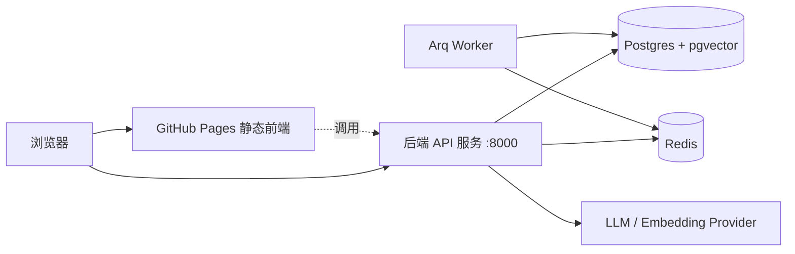

# 部署指南（Deployment Guide）

本指南说明如何把在开发机构建好的「Offer 捕手 / OfferPilot」成品部署到**线上机器**。

> 交付物有两类：
> 1. **后端**：Docker 镜像（API + worker），连同 Postgres(pgvector) 与 Redis。
> 2. **前端**：静态站点，默认发布到 **GitHub Pages**；也可用 nginx 容器自托管。

---

## 1. 部署形态总览



前端是纯静态资源，可放 CDN / GitHub Pages；后端是独立服务，需要数据库、缓存与（可选的）
真实 LLM。两者通过 HTTPS + CORS 通信。

---

## 2. 后端部署（Docker）

### 2.1 在目标机准备

目标机只需安装 **Docker（含 compose v2）**，无需 conda/Python/Node。

```bash
git clone <repo-url> OfferPilot
cd OfferPilot/infra
cp .env.example .env          # 按生产环境修改（见下方清单）
```

### 2.2 生产环境变量清单（`infra/.env`）

| 变量                 | 生产建议                                                       |
| -------------------- | -------------------------------------------------------------- |
| `ENVIRONMENT`        | `production`                                                   |
| `POSTGRES_PASSWORD`  | **强随机密码**，勿用默认值                                     |
| `JWT_SECRET`         | **强随机串**（如 `openssl rand -hex 32`）                      |
| `AI_PROVIDER`        | `openai_compatible`（接真实模型）或保留 `fake`                 |
| `CORS_ORIGINS`       | 前端真实域名，如 `https://<user>.github.io`                    |
| `LOG_JSON`           | `true`（便于日志平台采集）                                     |

接真实 LLM 时，在 api/worker 的环境中补充（见 `services/api/.env.example`）：
`AI_API_BASE`、`AI_API_KEY`、`AI_CHAT_MODEL`、`AI_EMBEDDING_MODEL`。

### 2.3 启动

```bash
docker compose up --build -d db redis api worker
docker compose ps                      # 确认 healthy
curl -fsS http://localhost:8000/api/v1/health
```

### 2.4 数据库迁移

> 业务数据表自阶段 P1 起由 Alembic 管理。迁移落地后，发布流程中加入：

```bash
# 方式一：进入 api 容器执行
docker compose exec api alembic upgrade head
# 方式二：本地连生产库执行（需 conda 环境）
make migrate
```

后续可将 `alembic upgrade head` 作为 api 容器的启动前置步骤（entrypoint），实现自动迁移。

### 2.5 反向代理与 TLS

生产环境应在前面放一层反向代理（Nginx / Caddy / 云负载均衡）做 **HTTPS 终止**，
并将 `/api` 转发到 api 容器的 8000 端口。请勿将明文 8000 直接暴露公网。

---

## 3. 前端部署

### 3.1 GitHub Pages（默认）

仓库已内置 `.github/workflows/deploy-web.yml`：

1. 在 GitHub 仓库 **Settings → Pages** 中，Source 选择 **GitHub Actions**。
2. 在 **Settings → Secrets and variables → Actions → Variables** 新增仓库变量
   `VITE_API_BASE_URL`，值为后端公网地址，例如 `https://api.example.com/api/v1`。
3. 推送到 `main`（或手动触发该 workflow）即自动构建并发布。
   - 工作流会把 `VITE_BASE_PATH` 设为 `/<repo>/`（项目站点子路径）。
   - 若使用自定义域名或用户主页站点（根路径），把 `VITE_BASE_PATH` 改为 `/`。

### 3.2 自托管（nginx 容器）

```bash
cd infra
docker compose up --build -d web      # 静态站点由 nginx 提供，默认 :8080
```

构建时通过 build args 注入 `VITE_API_BASE_URL`、`VITE_BASE_PATH`
（见 `apps/web/Dockerfile` 与 `infra/docker-compose.yml`）。

---

## 4. 发布前检查清单

- [ ] `JWT_SECRET`、`POSTGRES_PASSWORD` 已替换为强随机值。
- [ ] `CORS_ORIGINS` 仅包含前端真实域名。
- [ ] 后端置于 HTTPS 反向代理之后，未直接暴露明文端口。
- [ ] 如接真实 LLM，`AI_API_KEY` 通过密钥管理注入，未写入镜像或仓库。
- [ ] 数据库已执行 `alembic upgrade head`（P1 起）。
- [ ] 前端 `VITE_API_BASE_URL` 指向正确后端，`VITE_BASE_PATH` 与部署路径一致。
- [ ] 备份策略：Postgres 数据卷（`pgdata`）纳入定期备份。

---

## 5. 扩展与演进（预留接口）

当前后端是**模块化单体**，已按领域纵切（`app/modules/<domain>`），未来可平滑演进：

| 演进方向         | 落地方式                                                                 |
| ---------------- | ------------------------------------------------------------------------ |
| 水平扩容         | api 无状态，可多副本部署在负载均衡之后；worker 可按队列独立扩容。         |
| 拆分微服务       | 以 `modules/<domain>` 为边界整体迁出为独立服务，模块间已仅通过 service 接口协作。 |
| 替换 LLM 供应商  | 实现 `app/ai/providers/base.py` 接口的新 Provider，改 `AI_PROVIDER` 即可切换。 |
| 替换向量库       | 当前用 pgvector；可替换为独立向量数据库，仅改数据访问层。                 |
| 任务队列升级     | Arq（Redis）可替换为更重的队列；worker 装配集中在 `app/workers/`。        |

> 这些都不需要改业务代码主干，只需替换适配层或调整部署拓扑。
